

  <a href="https://www.linkedin.com/in/camponogaraviera" target="_blank" style="margin-right: 16px;">
    <svg width="28" height="28" viewBox="0 0 24 24" fill="currentColor">
      <path d="M4.98 3.5C4.98 4.88 3.86 6 2.48 6S0 4.88 0 3.5 1.12 1 2.48 1s2.5 1.12 2.5 2.5zM0 8h5v16H0V8zm7.5 0h4.8v2.2h.1c.67-1.27 2.3-2.6 4.74-2.6C22.2 7.6 24 10.1 24 14.3V24h-5v-8.4c0-2-.04-4.6-2.8-4.6-2.8 0-3.2 2.2-3.2 4.5V24h-5V8z"/>
    </svg>
  </a>

  <a href="https://github.com/camponogaraviera" target="_blank">
    <svg width="28" height="28" viewBox="0 0 24 24" fill="currentColor">
      <path d="M12 .5C5.37.5 0 5.87 0 12.5c0 5.3 3.44 9.8 8.2 11.38.6.1.82-.26.82-.58 0-.28-.01-1.04-.02-2.04-3.34.72-4.04-1.61-4.04-1.61-.54-1.39-1.33-1.76-1.33-1.76-1.09-.74.08-.72.08-.72 1.2.08 1.84 1.24 1.84 1.24 1.08 1.84 2.82 1.31 3.5 1 .1-.78.42-1.31.76-1.61-2.66-.3-5.47-1.33-5.47-5.93 0-1.31.47-2.39 1.24-3.24-.12-.3-.54-1.52.12-3.16 0 0 1.01-.32 3.3 1.24a11.5 11.5 0 016 0c2.29-1.56 3.3-1.24 3.3-1.24.66 1.64.24 2.86.12 3.16.77.85 1.24 1.93 1.24 3.24 0 4.61-2.81 5.62-5.49 5.92.43.37.82 1.11.82 2.24 0 1.62-.01 2.93-.01 3.33 0 .32.22.69.83.57C20.57 22.29 24 17.8 24 12.5 24 5.87 18.63.5 12 .5z"/>
    </svg>
  </a>

  <h1 align="center">
    <a href="https://camponogaraviera.github.io">
       Portfolio 
    </a>
  </h1>
  <h3 align="center"> Production AI Systems • Production AI Applications • SE/RL/LLM Courses • Course Projects </h3>

# Table of Contents 

- [Flagship AI Products](#flagship-ai-products)
  - [Production AI Systems](#production-ai-systems)
    - Quiver Compiler: Graph Reinforcement Learning-based Quantum Compiler
    - Quiver ML Runtime: Custom Machine Learning Runtime for Quiver Compiler
  - [Production AI-Powered Applications](#production-ai-powered-applications)
    - QuCAI-Lab Web Platform: Quantum Compilation as a Service (QCaaS)
    - Spotnack: Social Food Discovery & Booking Mobile App with Chat-based Recommendations and 3D Interactivity 

- [Authored Software Engineering Courses](#authored-software-engineering-courses)
  - Modern JavaScript (ES6+): Fundamentals to Advanced Concepts
  - Data Structures & Algorithms: Python, Modern JavaScript (ES6+), and C++: Foundations for Problem Solving and Technical Interviews - LeetCode & DSA Patterns
  - Fundamentals of React Native with Hooks & Industry Best Practices
  - Full-Stack AI Software Engineer Roadmap
  - AWS Roadmap + Technical Interview

- [Authored AI Courses](#authored-ai-courses)
  - TensorFlow & PyTorch API Tutorial
  - Deep Learning Roadmap + Technical Interview
  - Reinforcement Learning Roadmap: Theory and Implementations of Deep Reinforcement Learning Algorithms in TensorFlow and PyTorch
  - Large Language Model Roadmap: End-to-end Large Language Models in PyTorch + Technical Interview

- [Authored Course Projects](#authored-course-projects)
  - Neural Networks
    - Vanilla NumPy MLP with SGD and Backpropagation 
  - RL Algorithms
    - RL DDPG Agent with Custom Gym-compliant Environment and Industry Best Practices 
  - Production-Grade Applications
    - Chat Horizon: Full-Stack AI Web Chat Application with In-Browser LLM Inference 
    - Designer: AI Web Platform for 3D World Creation via Natural Language Prompts 
    - Social Eats: Social Food Discovery Mobile App with 3D Interactivity 

---

# Flagship AI Products

## Production AI Systems 

Startup Founder [@QuCAI-Lab](https://www.qucailab.company/):

- [Quiver Compiler: Graph Reinforcement Learning-based Quantum Compiler](https://www.qucailab.company/technology)

- [Quiver ML Runtime: Custom Machine Learning Runtime for Quiver Compiler](https://github.com/camponogaraviera/quiver-runtime)

## Production AI-Powered Applications

Startup Founder [@QuCAI-Lab](https://www.qucailab.company/):

- [QuCAI-Lab Web Platform: Quantum Compilation as a Service (QCaaS)](https://www.qucailab.company/)

  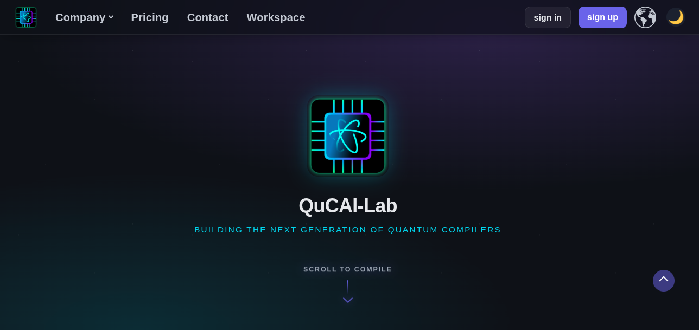
  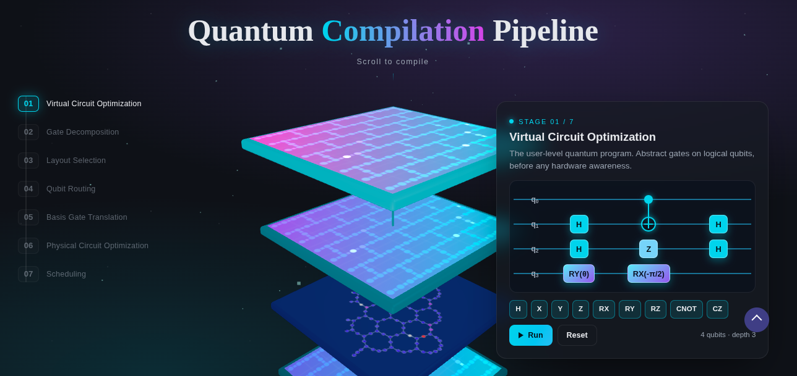

  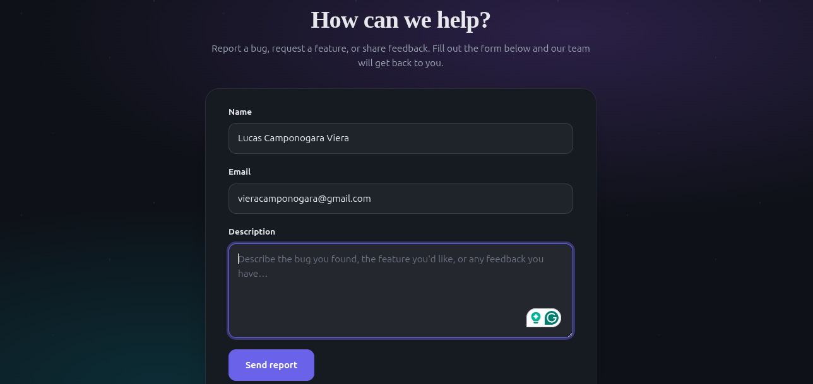
  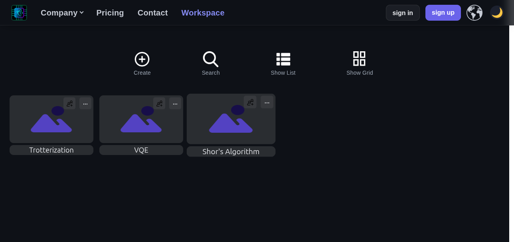

Startup Founder [@Spotnack](https://spotnack.com/):

- [Spotnack: Social Food Discovery & Booking Mobile App with Chat-based Recommendations and 3D Interactivity](https://github.com/spotnack)
 

  
  

  
  

---

# Authored Software Engineering Courses 

(Open-source)

- [Modern JavaScript (ES6+): Fundamentals to Advanced Concepts](https://github.com/camponogaraviera/javascript)

- [Data Structures & Algorithms: Python, Modern JavaScript (ES6+), and C++: Foundations for Problem Solving and Technical Interviews - LeetCode & DSA Patterns](https://github.com/camponogaraviera/ds-and-algo)

- [Fundamentals of React Native with Hooks & Industry Best Practices](https://github.com/camponogaraviera/react-native)

- [Full-Stack AI Software Engineer Roadmap](https://github.com/camponogaraviera/full-stack-ai-sw-roadmap)

- [AWS Roadmap + Technical Interview](https://github.com/camponogaraviera/aws)

---

# Authored AI Courses 

(Open-source)

- [TensorFlow & PyTorch: API Tutorial](https://github.com/camponogaraviera/tf-torch)

(Private)

- [Deep Learning Roadmap + Technical Interview](https://github.com/camponogaraviera/deep-learning-intro)

- [Reinforcement Learning Roadmap: Theory and Implementations of Deep Reinforcement Learning Algorithms in TensorFlow and PyTorch](https://github.com/camponogaraviera/rl-roadmap)

- [Large Language Model Roadmap: End-to-end Large Language Models in PyTorch + Technical Interview](https://github.com/camponogaraviera/llm-roadmap)

---

# Authored Course Projects

## Neural Networks

(Open-source)

- [Vanilla NumPy MLP with SGD and Backpropagation](https://github.com/camponogaraviera/vanilla-numpy-mlp-backprop)
  - Tech Stack: Python and NumPy.

## RL Algorithms

(Open-source)

- [RL DDPG Agent with Custom Gym-compliant Environment and Industry Best Practices](https://github.com/camponogaraviera/rl-ddpg)
  - Tech Stack: Python, NumPy, TensorFlow, Gymnasium, and scQubits.

## Production-Grade Applications

(Private)

- [Chat Horizon: Full-Stack AI Web Chat Application with In-Browser LLM Inference](https://github.com/camponogaraviera/chat-horizon-web)
  - Tech Stack: Python, Modern JavaScript (ES6+), TypeScript, PyTorch, ONNX, Transformers.js, React.js + Vite, Node.js, Express.js, DynamoDB, Docker, GitHub Actions, and AWS.
  

  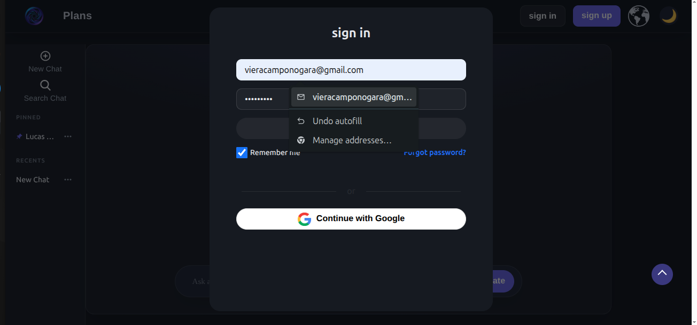
  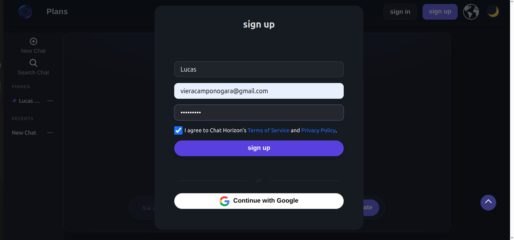

  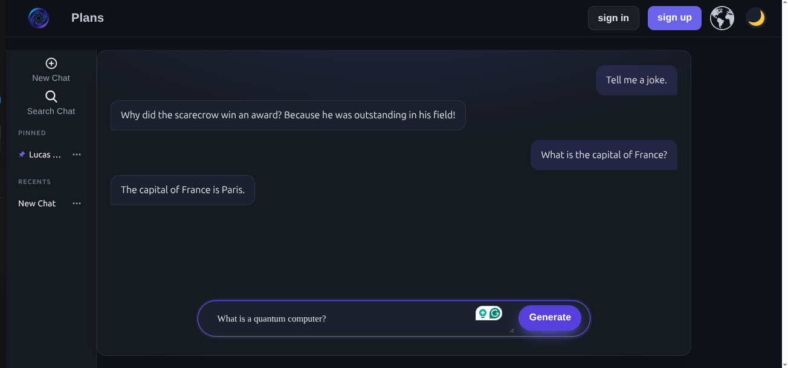
  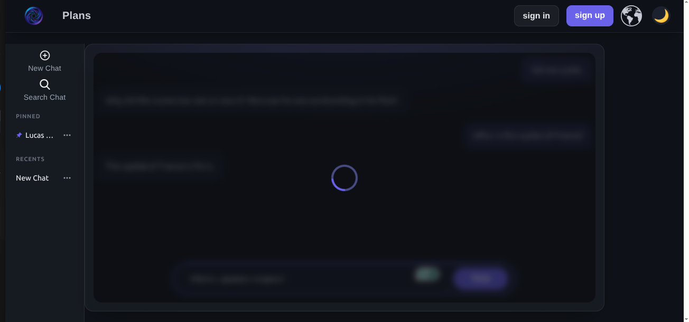

  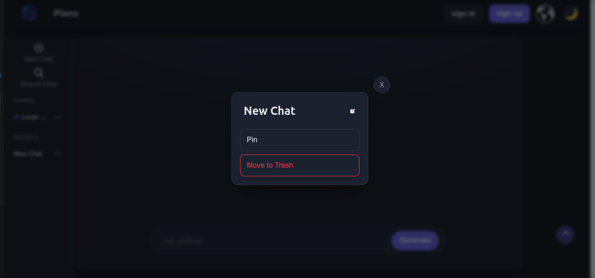
  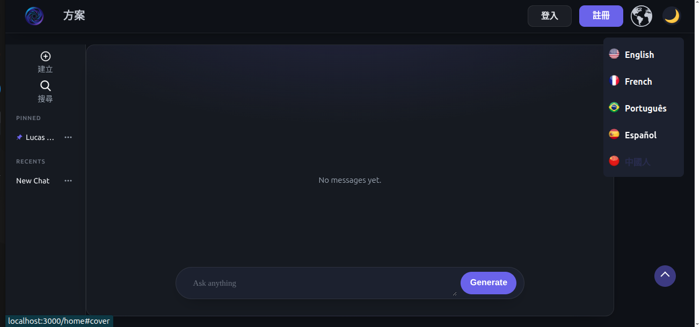

- [Designer: AI Web Platform for Interactive 3D World Creation via Natural Language Prompts](https://github.com/camponogaraviera/designer)
  - Tech Stack: Python, Modern JavaScript (ES6+), TypeScript, PyTorch, ONNX, Transformers.js, React.js, React Three Fiber, and React Three Drei.

  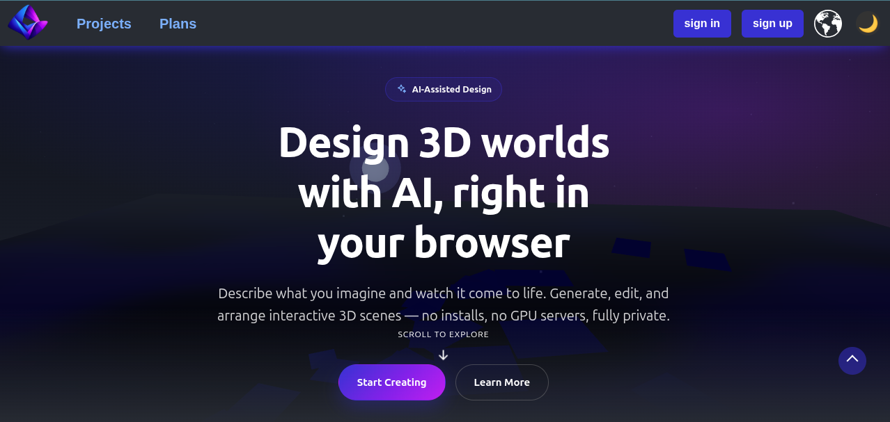
  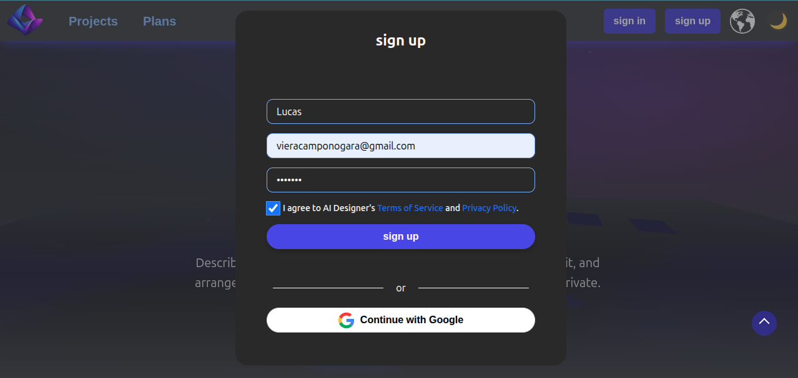

  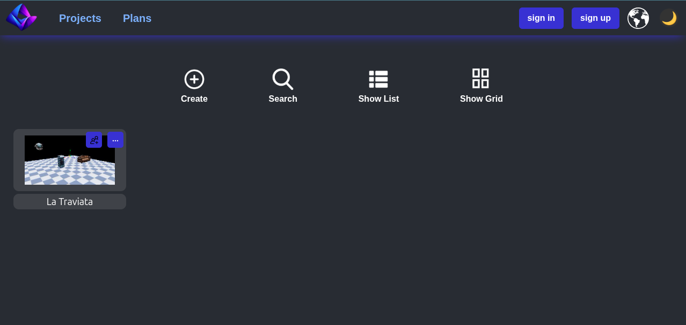
  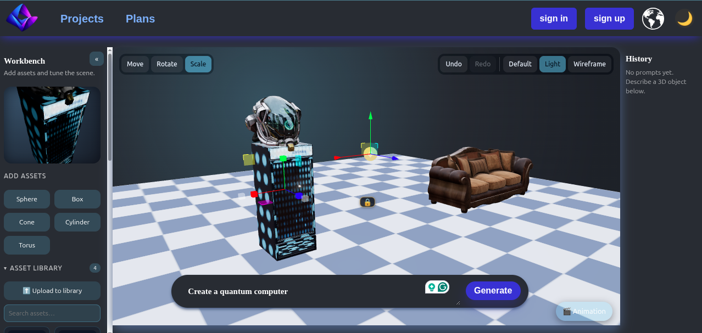

  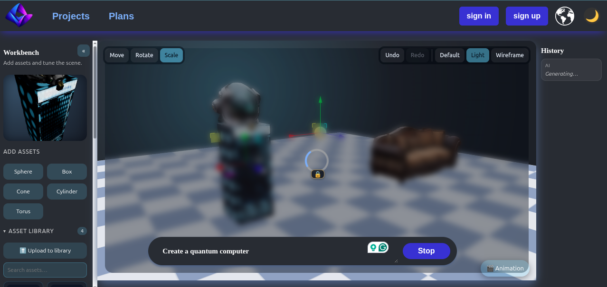
  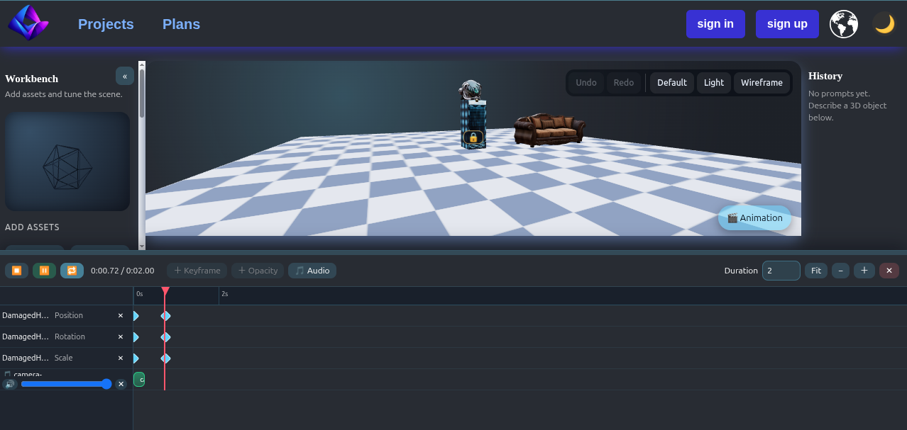

- [Social Eats: Social Food Discovery Mobile App with 3D Interactivity](https://github.com/camponogaraviera/social-eats) 
  - Tech Stack: Modern JavaScript (ES6+), TypeScript, React Native, React Three Fiber, React Three Drei, Node.js, Express.js, DynamoDB, Docker, GitHub Actions, and AWS.
  

  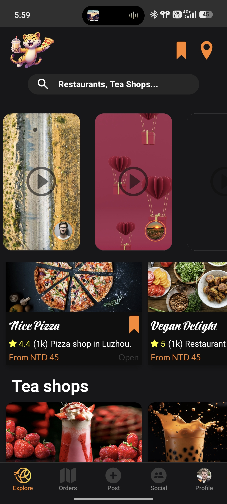
  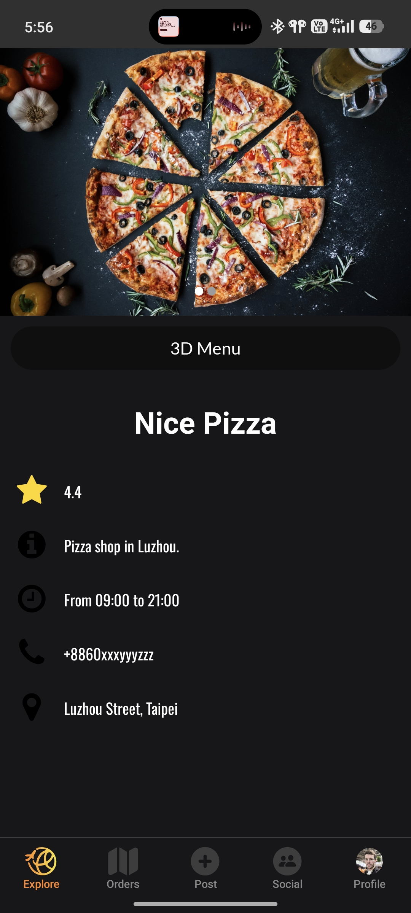

  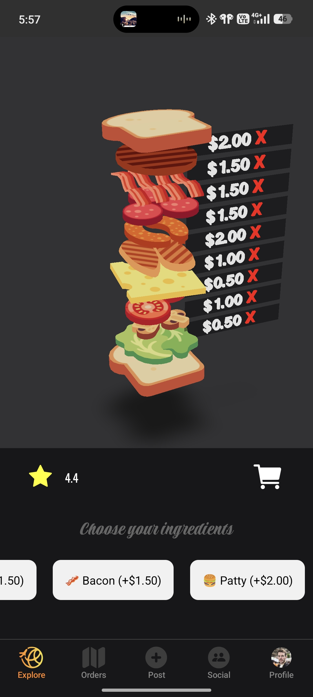
  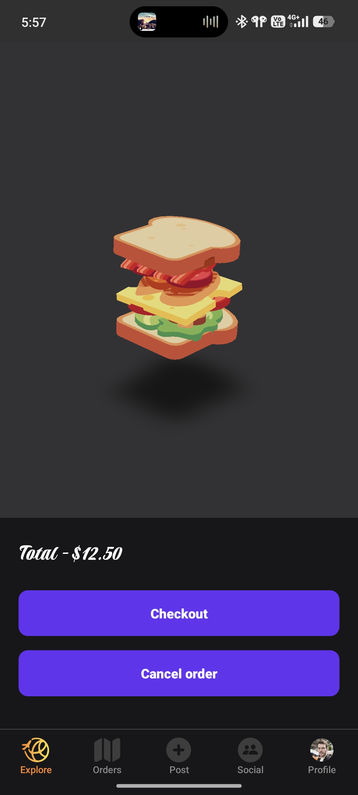

